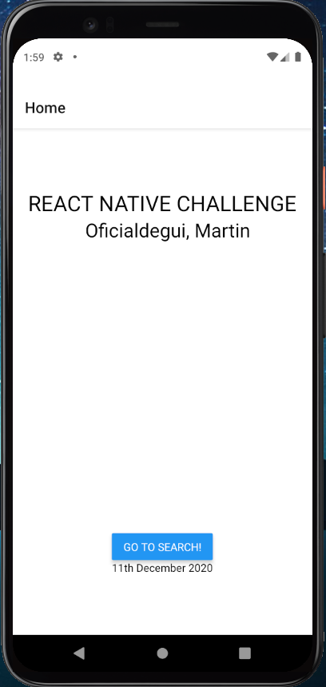
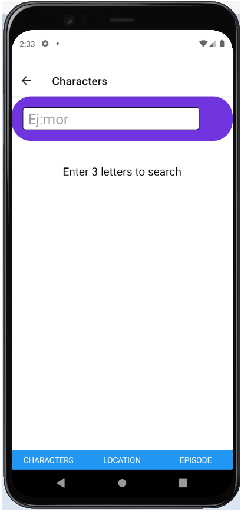
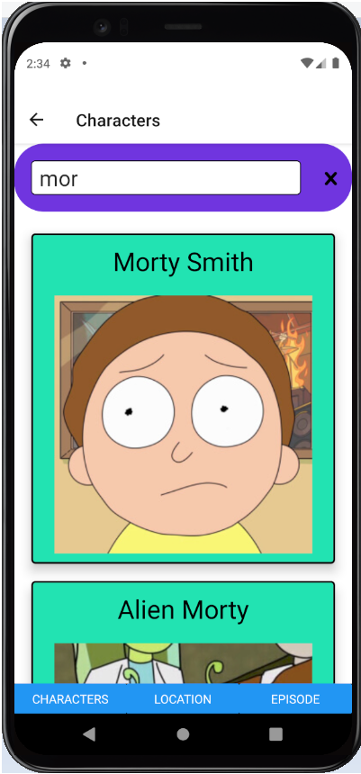
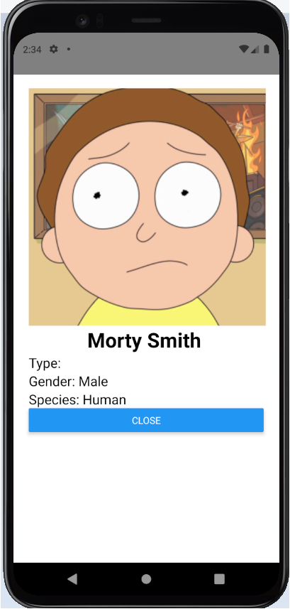
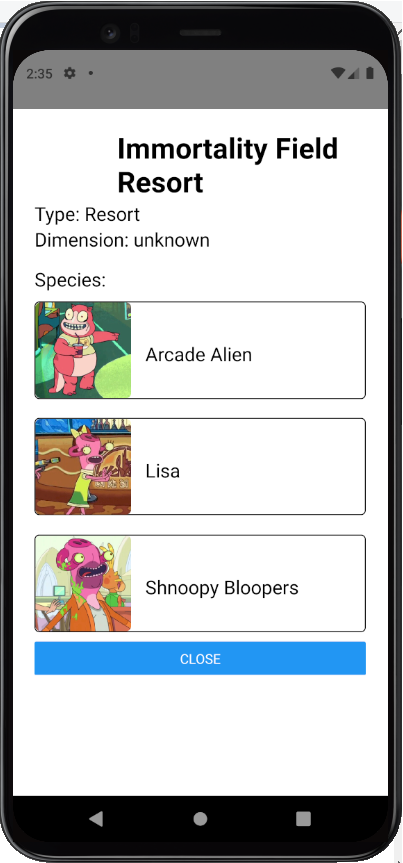

  <h1>Rick and Morty Searcher</h1>
  
The Ricky and Morty's searcher counts with 3 different filters we can choose: characters, locations and episodes. After a successful search, we could click on any of the results in order to see specific information about the selected ítem.
  
(The app was tested on android)

  <h2>Follow this stepts in order to run the application</h2>
  
Requirements

<ol>
  <li>Node.js </li>
  <li>Git</li>
  <li>Yarn(Recommended)</li>
</ol> 
  
Installing

<ol>
  <li>Run npm install --global expo-cli in cmd</li>
  <li>Cambiar al directiorio RNchallengeTS (puede ser un cd RNchallengeTS)</li>
  <li>Run yarn/npm start and wait a few moments</li>
</ol> 
<h2>Images</h2>

  

